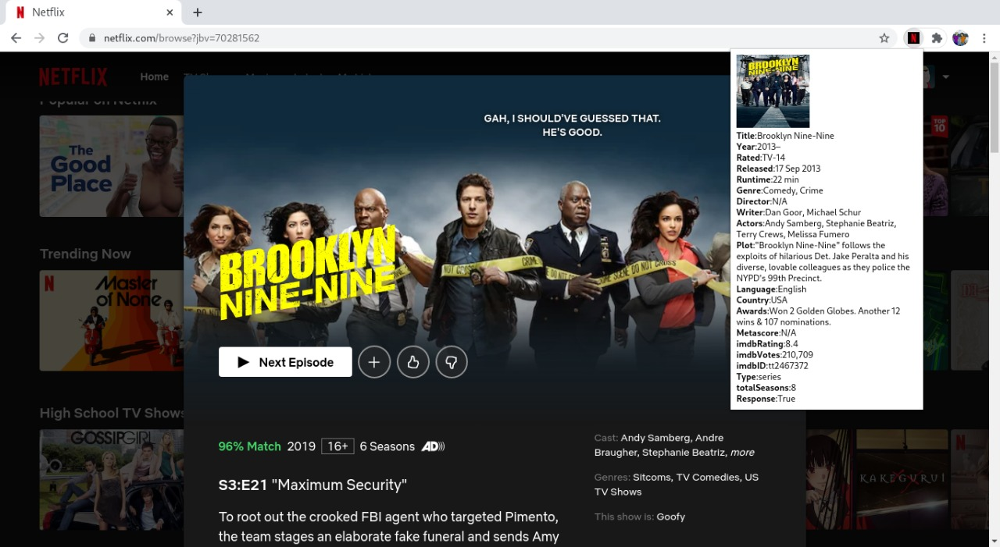

# Netflix_Information
A chrome extension to fetch [OMDB](http://www.omdbapi.com/) information of show/movie whilst using netflix.

### How to install: 
1) Clone the repository.
2) Open chrome, navigate to chrome://extensions.
3) Click on load unpacked extension, select directory named 'extension'.

### Usage:
1) Navigate to netflix, click on show/ hover over it to get short preview.
Now press the chrome extension (with Netflix logo, to get the details)

### Requirements:
None

### To-Do:
1) Make the extension faster by calling the API in background.js so that the result seems instantaneous. 
